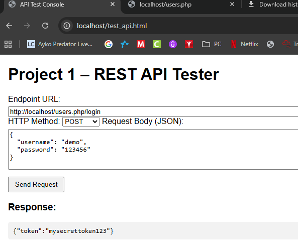

# Project 1: Secure & Deployable REST API  
**By Marshal Duncan**  
Building a PHP REST API with MySQL and NGINX

---

## Overview

This project demonstrates how to:
- Build a REST API in PHP  
- Connect it to a MySQL database  
- Handle CRUD operations  
- Implement authentication and security  
- Deploy and test using NGINX  

---

## Learning Objectives

By the end of this walkthrough, you should understand:
- PHP language basics  
- CRUD operations using MySQL  
- How to structure REST endpoints  
- Sending and receiving data with HTTP requests  
- Security measures for REST APIs  

---

## Basics of the PHP Language

PHP is a server-side scripting language commonly used for web development.  

**Core concepts include:**
- Variables: `$name = "Marshal";`  
- Arrays: `$users = array("Alice", "Bob", "Charlie");`  
- Loops: `foreach($users as $u) { echo $u; }`  
- Functions:  
  ```php
  function greet($name) {
      return "Hello, $name!";
  }
  ```

---

## PHP and JSON

REST APIs use JSON to exchange data.

```php
header('Content-Type: application/json');
$response = array("message" => "Welcome to the API");
echo json_encode($response);
```

---

## MySQL Database and CRUD Operations

CRUD = Create, Read, Update, Delete  

| Operation | SQL Example | PHP Example |
|------------|--------------|--------------|
| **Create** | `INSERT INTO users (name) VALUES ('Alex');` | `$stmt = $pdo->prepare("INSERT INTO users (name) VALUES (?)");` |
| **Read** | `SELECT * FROM users;` | `$users = $pdo->query("SELECT * FROM users")->fetchAll();` |
| **Update** | `UPDATE users SET name='Max' WHERE id=1;` | `$stmt = $pdo->prepare("UPDATE users SET name=? WHERE id=?");` |
| **Delete** | `DELETE FROM users WHERE id=1;` | `$stmt = $pdo->prepare("DELETE FROM users WHERE id=?");` |

---
### Please Use the Following Code in MySQL Before Testing PHP Files(to avoid error):
```
-- Create database
CREATE DATABASE IF NOT EXISTS project1;
USE project1;

-- Users table
CREATE TABLE IF NOT EXISTS users (
    id INT AUTO_INCREMENT PRIMARY KEY,
    username VARCHAR(50) NOT NULL UNIQUE,
    password VARCHAR(255) NOT NULL,
    email VARCHAR(100) NOT NULL UNIQUE,
    created_at TIMESTAMP DEFAULT CURRENT_TIMESTAMP
);

-- Friends table
CREATE TABLE IF NOT EXISTS friends (
    id INT AUTO_INCREMENT PRIMARY KEY,
    user_id INT NOT NULL,
    friend_id INT NOT NULL,
    FOREIGN KEY (user_id) REFERENCES users(id) ON DELETE CASCADE,
    FOREIGN KEY (friend_id) REFERENCES users(id) ON DELETE CASCADE
);

-- Insert test user
INSERT INTO users (username, password, email) VALUES 
('demo', '$2y$10$eW5a.PcL1i2g7x9kGxQfKuo8xWEm8cnvQJNTQhA6BlO2ZJe2PyGLe', 'demo@example.com'); -- password: 123456
```

## Connecting PHP to MySQL

```php
$dsn = "mysql:host=localhost;dbname=project1;charset=utf8mb4";
$username = "root";
$password = "200404";

try {
    $pdo = new PDO($dsn, $username, $password);
} catch (PDOException $e) {
    echo json_encode(["error" => $e->getMessage()]);
}
```

---

## Building a REST API in PHP

Our API endpoints:
- `GET /users` → List all users  
- `GET /users/{id}` → Get a user  
- `POST /users` → Create new user  
- `PUT /users/{id}` → Update user  
- `DELETE /users/{id}` → Delete user  
- `POST /users/login` → Login and get token  
- `GET /users/me` → Get authenticated user  
- `POST /users/{id}/friends` → Add friend  

---

## Routing Logic Example

```php
$request = $_SERVER['REQUEST_METHOD'];
$path = $_SERVER['REQUEST_URI'];

if ($path == '/users' && $request == 'GET') {
    getAllUsers();
} elseif ($path == '/users' && $request == 'POST') {
    createUser();
} else {
    echo json_encode(["error" => "Not found"]);
}
```

---

## Making HTTP Requests

You can use:
- Browser tools (GET requests)  
- **Postman** or **curl** for testing other methods  

**Example (curl):**
```bash
curl -X POST http://localhost/users      -H "Content-Type: application/json"      -d '{"name":"Marshal","email":"test@example.com"}'
```

**JavaScript Example:**
```js
fetch('/users', {
  method: 'POST',
  headers: { 'Content-Type': 'application/json' },
  body: JSON.stringify({ name: 'Alex', email: 'a@b.com' })
});
```

---

## Securing a REST API

Security matters most when handling user data.

**Main steps:**
- Use **password hashing** with `password_hash()`  
- Require authentication for private endpoints  
- Use **tokens (JWT or session-based)**  
- Validate all user input  
- Restrict database permissions (principle of least privilege)

---

## Example: Authentication Flow

```php
if ($path == '/users/login' && $request == 'POST') {
    $input = json_decode(file_get_contents('php://input'), true);
    $stmt = $pdo->prepare("SELECT * FROM users WHERE email=?");
    $stmt->execute([$input['email']]);
    $user = $stmt->fetch();

    if ($user && password_verify($input['password'], $user['password'])) {
        echo json_encode(["token" => base64_encode(random_bytes(16))]);
    } else {
        echo json_encode(["error" => "Invalid credentials"]);
    }
}
```
---

## 📁 Directory Structure

```
code/
 ├── index.php
 ├── config.php
 ├── users.php
 ├── test_api.html
presentation/
 └── project1_presentation.md
```

---

## API Endpoints

| Method | Endpoint | Description | Secure? |
|:--|:--|:--|:--|
| GET | /users | List all users | ❌ |
| GET | /users/{id} | Get user by ID | ❌ |
| POST | /users | Create new user | ❌ |
| PUT | /users/{id} | Update user | ❌ |
| DELETE | /users/{id} | Delete user | ✅ |
| POST | /users/login | Authenticate user | ❌ |
| GET | /users/me | Get current authenticated user | ✅ |
| PUT | /users/me/password | Change password | ✅ |
| GET | /users/{id}/friends | Get user’s friends | ❌ |
| POST | /users/{id}/friends | Add a friend | ✅ |

---

## Testing Endpoints with cURL

### Create User
```bash
curl -X POST http://localhost/users -H "Content-Type: application/json" -d '{"username":"test","password":"pass123"}'
```

### Login User
```bash
curl -X POST http://localhost/users/login -H "Content-Type: application/json" -d '{"username":"test","password":"pass123"}'
```

### Authenticated Request
```bash
curl -X GET http://localhost/users/me -H "Authorization: Bearer YOUR_TOKEN_HERE"
```

---
## Testing Endpoints with Http API Tester
When using the HTTP Tester you will go to http://localhost/test_api.html after getting your nginx server setup with all the files given, also make sure your SQL server is created and using the DB that I have provided or it will not work. for a quick test you can do the following

### Create User Test (Note: Body info can be switch just not the variable names)
Endpoint URL: http://localhost/users.php
HTTP Method: POST Request Body (JSON):
{
  "username": "demo",
  "password": "123456",
  "email": "demo@example.com"
}

### Show User Test
Endpoint URL: http://localhost/users.php
HTTP Method: GET Request Body (JSON):
### Login User Test
Endpoint URL: http://localhost/users.php/login
HTTP Method: Post Request Body (JSON):
{
  "username": "demo",
  "password": "123456",
}
### Response Showing Successful login


## NGINX Deployment Steps

1. Copy project folder to `C:\nginx\html\project1`
2. Update config file:
```
server {
    listen 80;
    server_name localhost;
    root C:/nginx/html/project1;  # Adjust path for your system
    index index.php index.html index.htm test_api.html;

    location / {
        try_files $uri $uri/ /index.php?$query_string;
    }

    location ~ \.php$ {
        fastcgi_pass 127.0.0.1:9000;  # PHP-FPM address
        fastcgi_index index.php;
        fastcgi_param SCRIPT_FILENAME $document_root$fastcgi_script_name;
        include fastcgi_params;
    }
}
```
3. Start NGINX + PHP-FPM and test http://localhost

---

## Summary

✔ PHP can easily serve RESTful endpoints  
✔ MySQL manages and stores user data  
✔ Routing and JSON keep things structured  
✔ HTTP requests let you send and receive info  
✔ Security keeps your API safe and compliant  

---

## End of Presentation

**Thank you for viewing Project 1!**  
Questions or testing help: feel free to ask during the demo session.
